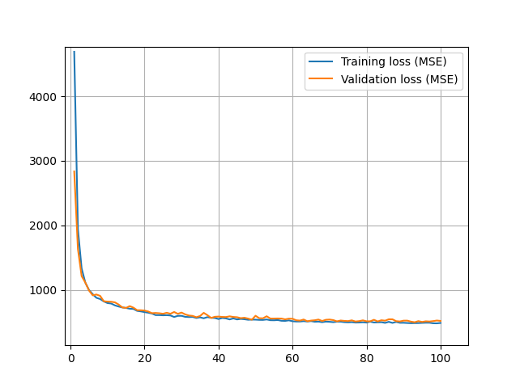
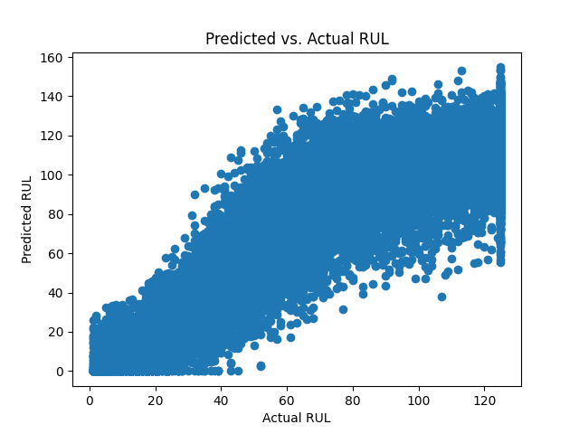

# CNN-LSTM for Remaining Useful Life (RUL) Prediction of Turbofan Engines

## Overview

This project focuses on replicating and validating a seminal research paper on predictive maintenance using data-driven probabilistic Remaining Useful Life (RUL) prognostics for aircraft turbofan engines. The goal is to implement a Convolutional Neural Network (CNN) and Long-Short Term Memory (LSTM) hybrid model as described in the study to assess its effectiveness using the C-MAPSS dataset.

## Dataset

The dataset used for this project is the C-MAPSS dataset, which contains sensor data from aircraft engines under various operational conditions. This data is crucial for training the predictive model to accurately forecast RUL based on real-world engine behavior.

- **Location of the dataset**: [C-MAPSS Dataset](https://github.com/TheBriteGroup/Elijah/tree/main/Assigned/CNN/Data)

## Code Description

Several Python scripts form the backbone of the project's codebase:

- **CNN.py**: Contains the CNN model's architecture and training procedures.
- **data_prep.py**: Handles preprocessing of the C-MAPSS dataset, including normalization and partitioning into training and testing sets.
- **evaluate.py**: Used for evaluating the model's performance on the test set, calculating metrics such as RMSE and probabilistic RUL estimates.
- **RUL_metrics.py**: Implements additional metrics for assessing the uncertainty and accuracy of the RUL predictions.

All scripts are well-documented and include comments explaining each step of the process.

## Model Architecture

- Separate CNN layers process Voltage (V), Current (I), and Temperature (T) inputs.
- Features from each CNN layer are concatenated and passed to subsequent CNN layers.
- The final extracted features from the CNN layers are concatenated with the output from the LSTM layer.

## Implementation

The implementation phase involved several steps in setting up and executing the CNN-LSTM model as prescribed by the original research paper. Key steps included:

1. **Data Preprocessing**: Normalizing the C-MAPSS dataset to match the conditions outlined in the research paper.
2. **Model Training**: Training the CNN-LSTM model on the preprocessed data.
3. **Evaluation**: Assessing the model's performance using RMSE, MAE, and other relevant metrics.

## Results

The CNN-LSTM model demonstrated high accuracy in predicting the RUL of turbofan engines, with the probabilistic approach providing not only point estimates but also confidence intervals, which are crucial for maintenance planning.

### Performance Metrics

| Engine Set | Total Predictions | Reliability Score (Under) | Reliability Score (Over) | Total Reliability Score | Coverage (Alpha = 0.5) | Mean Width (Alpha = 0.5) | Coverage (Alpha = 0.9) | Mean Width (Alpha = 0.9) | Coverage (Alpha = 0.95) | Mean Width (Alpha = 0.95) | RMSE  | MAE   | Mean Variance | Mean Std Dev |
|------------|--------------------|---------------------------|--------------------------|-------------------------|-------------------------|--------------------------|------------------------|--------------------------|-------------------------|--------------------------|-------|-------|---------------|--------------|
| FD001      | 17631              | 0.1253                    | 0.0009                   | 0.1262                  | 0.3552                  | 14.42                    | 0.7660                 | 34.71                    | 0.7660                  | 34.71                    | 15.38 | 12.04 | 113.04        | 10.40        |
| FD002      | 259                | 0.0541                    | 0.0044                   | 0.0585                  | 0.4672                  | 15.32                    | 0.8185                 | 36.14                    | 0.8185                  | 36.14                    | 14.18 | 10.79 | 123.42        | 10.91        |
| FD003      | -                  | 0.0260                    | 0.0086                   | 0.0346                  | 0.4700                  | 17.02                    | 0.9000                 | 39.84                    | 0.9000                  | 39.84                    | 13.06 | 10.39 | 155.01        | 12.16        |
| FD004      | 248                | 0.0609                    | 0.0036                   | 0.0646                  | 0.4274                  | 16.09                    | 0.8105                 | 38.85                    | 0.8105                  | 38.85                    | 15.97 | 12.01 | 139.90        | 11.59        |

## Training and Validation Loss

## Conclusions and Future Work

The project establishes a robust framework for predictive maintenance using deep learning and probabilistic modeling. Future work will focus on extending the model to other types of machinery and integrating real-time data feeds to allow dynamic prediction updates.

### Future Directions

- Expand the model's applicability to other industrial applications (e.g., PRONOSTIA Bearing Dataset, Lithium-Ion Batteries).
- Enhance the model's real-time data processing capabilities.
